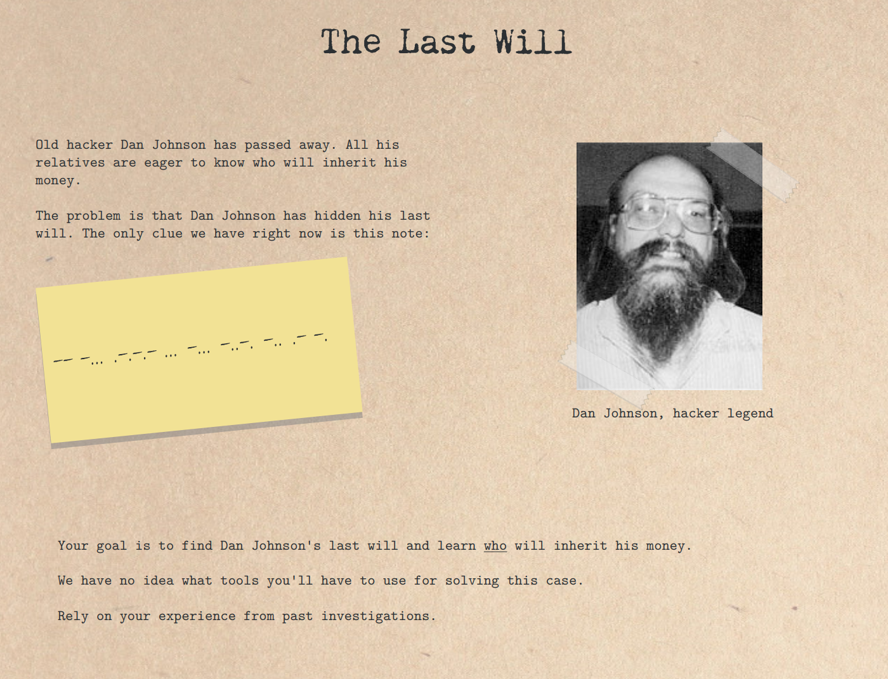
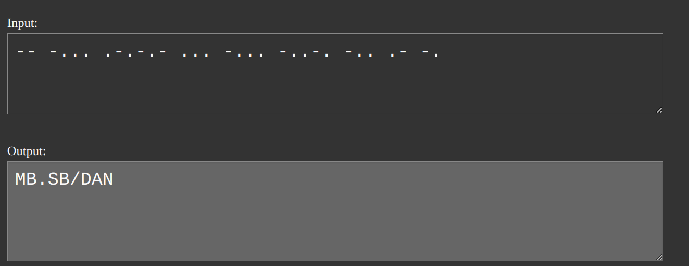
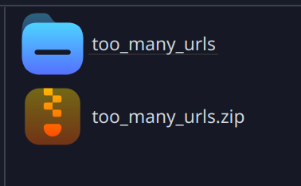
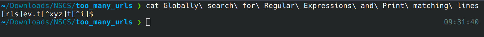
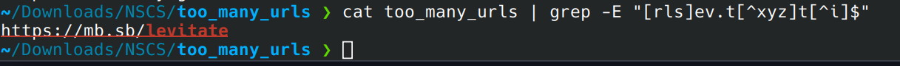
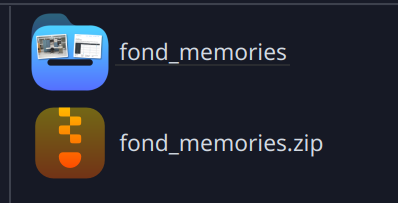
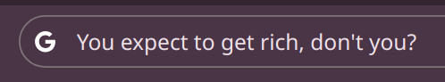
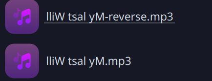
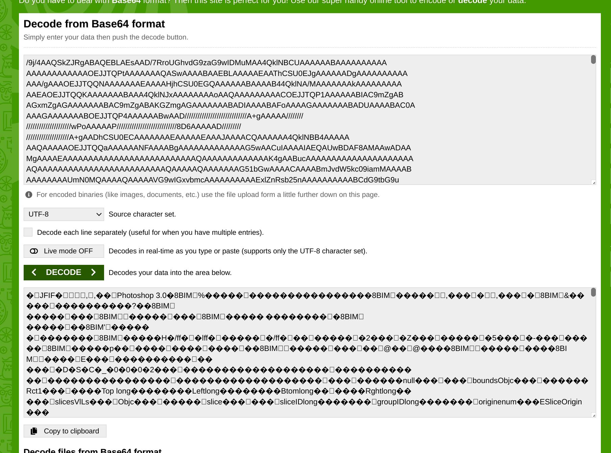

= The Last Will Lösung

== Mark Grünzweil, 3 AHIF, 29.11.2024

== Anleitung:

Als erstes schaut man sich die PDF an:

Dort findet man diesen Morsecode:

----
-- -... .-.-.- ... -... -..-. -.. .- -.
----

Diesen übersetzt man:

Danach erhält man diesen Link:

----
MB.SB/DAN
----

image::./Img/url.png[Bild]

Wenn man diesen Link dann öffnet, erhält man einen Zip-Ordner:

Wenn man das File in dem Folder ausgibt bekommt man diesen Regex:

----
[rls]ev.t[^xyz]t[^i]$
----

Danach sucht man im anderen Folder mit dem Regex und findet das:

----
https://mb.sb/levitate
----

Wenn man diesen Link öffnet, erhält man diesen Folder:

Danach öffnet man https://georgeom.net/StegOnline/upload[StegOnline].

image::./Img/stegonline.png[Bild]

Man lädt das Bild hoch und gibt das ein:

image::./Img/stegonline_input.png[Bild]

Wenn man das herunterlädt, erhält man das:

image::./Img/stegonline_code.png[Bild]

Wenn man diesen QR-Code scannt, bekommt man das:

----
You expect to get rich, don't you?
----

In dem Folder ist ein weiter zip Folder der Passwort geschützt ist:

image::./Img/error.png[Bild]

Das Passwort ist der Text von dem QR-Code:

Wenn man das File unzipped erhält man das:

image::./Img/folder_code.png[Bild]

Diese MP3 Datei muss man jetzt noch reversen:

image::./Img/reverse.png[Bild]

Wenn man die Datei abspielt, kann man hören:

----
Er vererbt sein ganzes Vermögen an seine Katze.
----

Das zweite Rätsel ist das Bild. 

Hier muss man die Base 64 Datei decoden:

image::./Img/base64.png[Bild]

Wenn man das macht erhält man das:

image::./Img/file.png[Bild]

image::./Img/file.jpeg[Bild]

Das ist ein Bild von seiner Katze.
