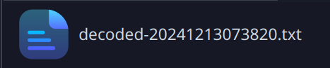

= Where is the solution?

== Mark Grünzweil, 3 AHIF, 06.12.2024

== Lösung

**Herunterladen der Anfangsdatei**


**Benutzen von Testdisk um die Datei zu bekommen**


image::./Img/after_testdisk.png[Bild]

**Lesen der PDF Datei 'Instructions_for_James.pdf'**

[Bild]

**Auf https://georgeom.net/StegOnline/upload[StegOnline] gehen und die Datei hochladen**


> **_Note:_**  Die Datei ist komplett sinlos und hat keinen wertvollen Inhalt für die Lösung.

**Decoden der Base64 Datei**


image::./Img/base64_decode.png[Bild]



Inhalt der Datei:

```
----------------------------------------+------------------------
PASSWORD                                | DESCRIPTION
----------------------------------------+------------------------
We can be heroes, just for one day      | QR codes for James
----------------------------------------+------------------------
Life on Mars?                           | Twitter
----------------------------------------+------------------------
Ground control to Major Tom             | SoundCloud
----------------------------------------+------------------------
```

**Den Verschlüsselten Zip Ordner decoden**

Passwort: We can be heroes, just for one day


**Den QR-Code scannen**


**Auf dieser Website das Bild herunterladen**


**Dieses Bild wieder auf https://georgeom.net/StegOnline/upload[StegOnline] hochladen**


image::./Img/stegOnline_qrcode_file_result.png[Bild]

**Downloaden der Datei**


**Den Sound anhören**

Beim Anhören kann man der er das Geld hier versteckt hat:

```
Westminster Street 14, behind the trashcan 
```
